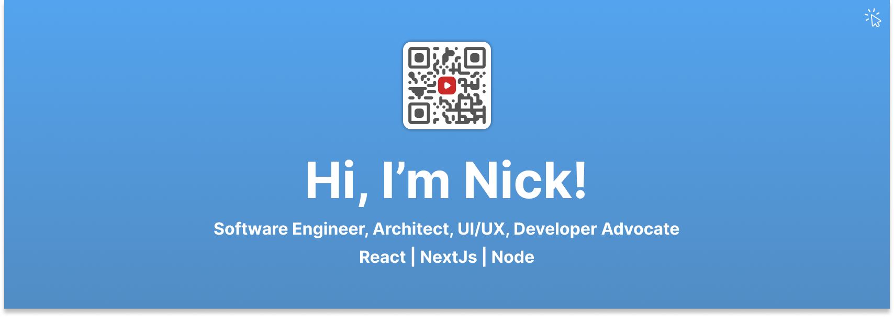
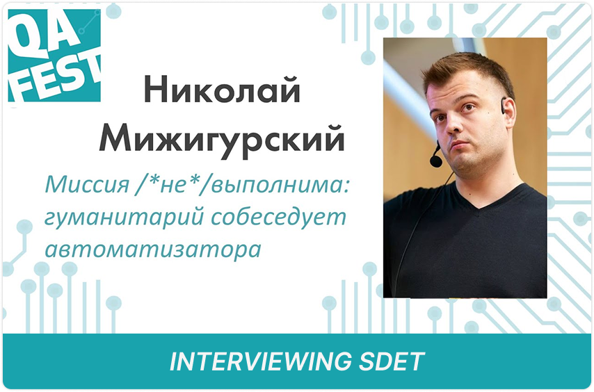
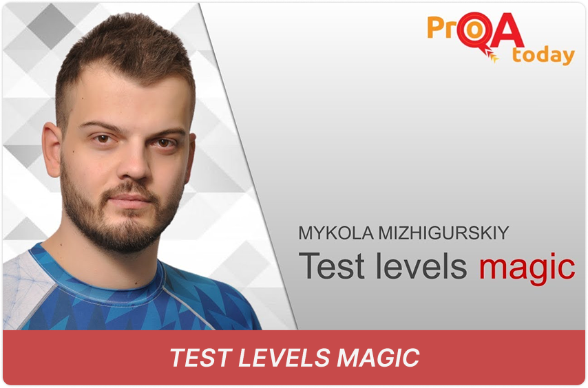
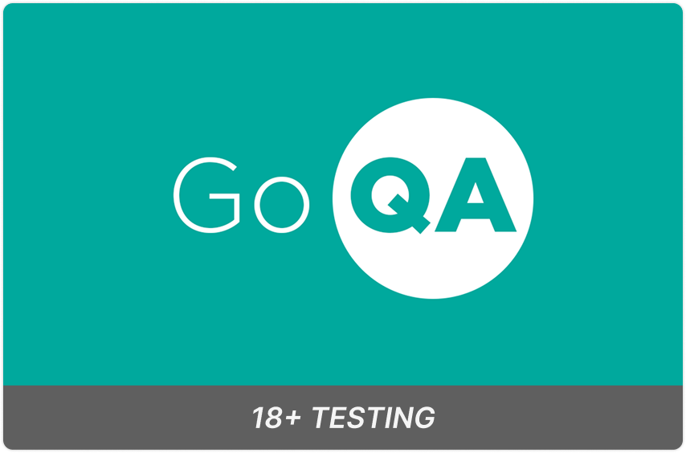
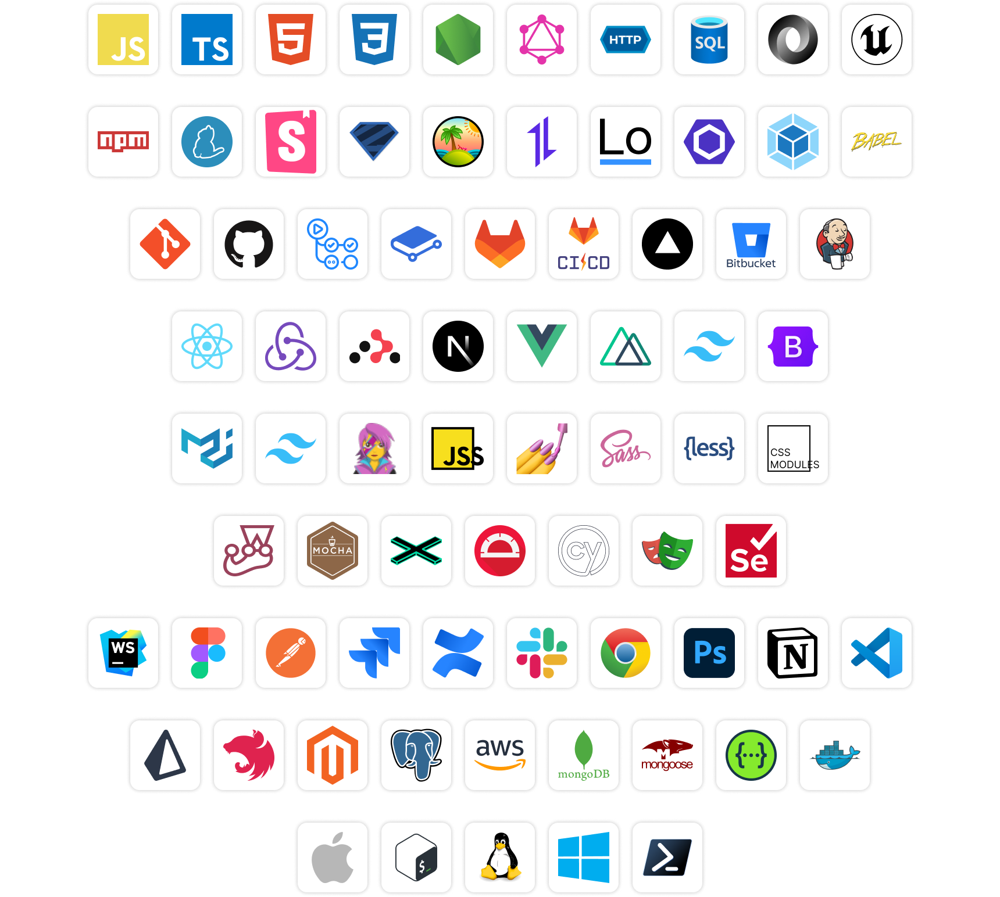

I am an experienced Software Development Engineer with over 12 years in IT, specializing in building scalable front-end
architectures. Proficient in React, TypeScript, and various modern libraries and frameworks like NextJS, Material UI,
and Tailwind.

I am an AI enthusiast, and my main passion is optimizing development productivity by streamlining routine processes with
AI assistants. From my experience, incorporating AI for tasks like commit generation, writing auto-tests and
documentation, code review, and pull request management can increase productivity by up to 100%. Check out my custom
tailored prompts library down below.

<h1 align="center">Philosophy</h1>

<b>AI-driven development</b>

> I specialize in leveraging AI to streamline routine processes such as generating commit messages, writing automated
> tests, producing documentation, and managing code reviews and pull requests.
>
> I created [custom prompt library](https://gist.github.com/KiT-Maverik), ready for immediate implementation, which can
> boost productivity by up to 100%.

<b>Lightning-fast project start</b>

> I identified frequently recurring functionalities across various applications, and developed a comprehensive library
> of reusable components and utilities. This library enables rapid project initiation, allowing me to deliver a functional
> prototype in record time.
>
> Considering the amount of work put in this library, `I am saving about $30k` for projects starting from scratch

<b>Contract-Driven Development</b>

> Imagine being able to eliminate guesswork, build trust, and streamline communication across your entire software
> delivery pipeline—before a single line of implementation code is written. That’s what contract-driven development brings
> to the table.
>
> By defining clear, testable contracts up front, your team aligns instantly on the `what` and `how` of your APIs,
> empowering developers, testers, and product managers to work in harmony.
> The result? Robust, future-proofed integrations that can adapt gracefully to new business requirements. With
> contract-driven development, you’ll deliver high-quality software at a faster pace, keep stakeholders happy, and set
> your products apart with a standard of excellence everyone can rely on. In short, it’s not just a methodology—it's a
> smarter, more predictable path to success.

<b>Owner’s Mindset</b>

> Having worked in product companies, I treat every line of code like it's part of a product I personally own. From
> ideation to user experience, I'm driven to refine, improve, and go the extra mile—ensuring every release meets the
> highest standards for both performance and impact.

<b>Software Development Constitution</b>

> I believe nothing fosters efficient collaboration better than a clear, unified ruleset.
>
> wI’ve created a `Software Development Constitution` covering coding standards, commit messages, naming conventions,
> and PR review guidelines—ensuring every team member aligns on best practices and delivers top-quality results.

<b>Storybook</b>

> I advocate for leveraging the full potential of Storybook's ecosystem.
>
> I specialize in enabling its capabilities across diverse teams, including `design`, `QA`, `management`, `frontend`,
> and `backend`. My expertise includes setting up comprehensive environments for early demos, and testing. I craft
> components with complete lifecycle support, incorporating variants, themes, and seamless mocked API interactions.

<b>Alpha testing</b>

> I believe, early testing based on requirements and designs, conducted in cooperation with design, product, QA,
> backend, and frontend teams is essential to the product success. This practice allows to finds bugs early in SDLC,
> leading to reduced project costs and improved development efficiency.

<h1 align="center">Valuable skills</h1>

<b>Fluent English</b>

> With a philosophy degree in English Philology and certification from the British Council, I’ve built my career at
> global product companies, bridging language and cultural gaps through precise, engaging communication. My expertise
> ensures seamless collaboration in any international setting.

<b>UI/UX</b>

> As a front-end developer with a keen focus on UI/UX, I bridge the gap between design and development.
>
> My experience includes creating design systems and implementing complex Figma projects for `WEB` and `VR`, ensuring
> seamless, user-centered products. This holistic skill set fosters collaboration with design teams and delivers polished,
> intuitive interfaces.

<b>Technical Writing</b>

> With a philology degree and extensive experience, I excel in crafting documentation for complex systems and
> supervising technical writing teams.
>
> I integrate AI-powered solutions to enhance efficiency, utilizing tools like GitHub, wikis, and Storybook for seamless
> documentation. My expertise includes integrating code documentation in Storybook and developing custom-tailored
> documentation to meet project-specific needs.

<b>Process management</b>

> Specialized in designing and implementing clear, effective, and self-sustaining development processes that prioritize
> team comfort and productivity. Expertise includes formal documentation-based code reviews, PR/MR supervision, process
> documentation, and leveraging tools like Jira with automation to streamline workflows and enhance transparency.

<b>Requirement engineering</b>

> Skilled in gathering and analyzing requirements while implementing tech-supported traceability systems. I excel at
> conducting reviews and fostering effective collaboration among QA, business, and development teams to ensure
> comprehensive and actionable requirement management.

<b>Quality Assurance</b>

> I have deep expertise in QA domain (6+yoe), enabling me to enhance collaboration with QA teams, efficiently design
> testing environments, perform early-stage bug detection, and implement quality-focused practices that reduce costs and
> ensure robust deliverables.

<b>Mentoring</b>

> I am a skilled mentor with a track record of rapidly advancing team members from junior to strong middle levels. My
> best case is successfully guiding a trainee to achieve a middle-level role in just three months. I utilize a proprietary
> learning framework based on neuropsychology principles to enhance knowledge retention and skill development effectively.

<b>Interviewing</b>

> I have extensive experience in interviewing candidates.
>
> `After conducting more than 100 interviews`, I developed a unique, objective evaluation process grounded in a custom
> skills matrix spanning key software development domains. Each interview results in a transparent, metrics-driven report
> within just one hour. This can streamline hiring, save time, and confidently choose the right talent, backed by data
> rather than subjective opinions.

<b>Public speaking</b>

> With years of experience presenting ideas, products, and companies to large audiences, I turn complex concepts into
> clear, engaging stories that inspire action. Whether it's a pitch, a keynote, or a demo, I know how to own the stage and
> win the room.

<b>Backend engineering</b>

> While I don’t primarily position myself as a backend engineer, I bring valuable experience in the field, particularly
> with the MERN stack, Prisma, and AWS Lightsail. This expertise allows me to contribute effectively to backend
> development tasks as part of a comprehensive project solution.

<h1 align="center">Content</h1>

<b>Public speaking / QA / UA</b>

<a href="https://www.youtube.com/watch?v=CHJTcIXaKyc&ab_channel=FestGroup"><!--
--><!--
--></a><!--
--><a href="https://www.youtube.com/watch?v=Siez-wHrNns&ab_channel=QAExpertsPro"><!--
--><!--
--></a><!--
--><a href="https://www.youtube.com/watch?v=w1fCXg_-jDQ&ab_channel=QADay"><!--
--><!--
--></a>

<h1 align="center">Knowledge matrix</h1>

